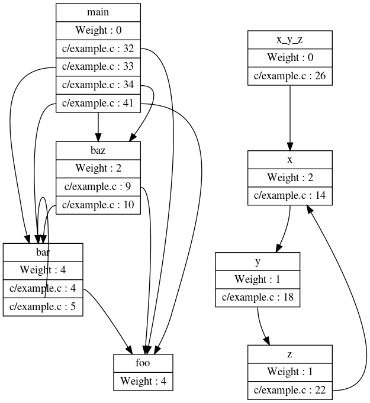

# Call Graph


## Building

These instructions assume that your current directory starts out as the
"callgrapher" directory within the package.


```bash
$ mkdir build
$ cd build
$ cmake ..
$ make
```

This produces a dynamic callgrapher tool called
tools/callgrapher/callgrapher and a library for printing out the
static call graph in *lib/callgraphs/callgraphs.so*.

To generate call graph for the C file located in *test/simpletest.c* you
would do the following

```bash
$ clang -g -S -emit-llvm ../test/simpletest.c
$ ./tools/callgrapher/callgrapher simpletest.ll | dot -Tpng > graph.png
```

And you will have a png that looks like the following:



